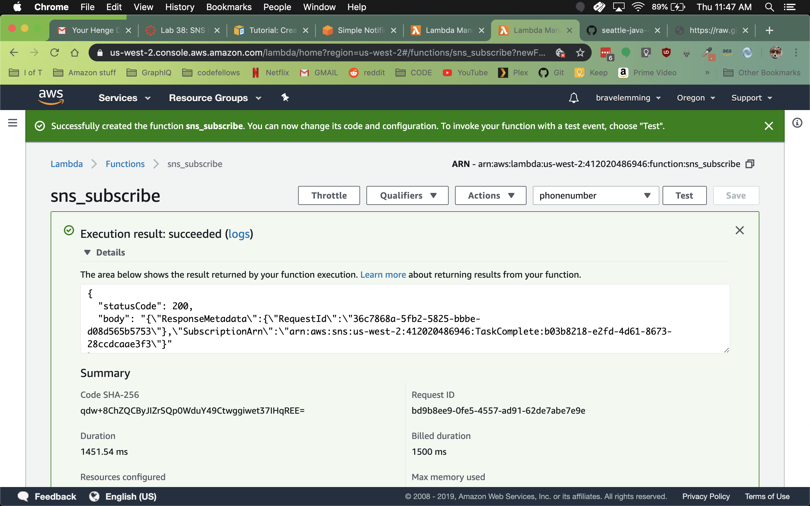
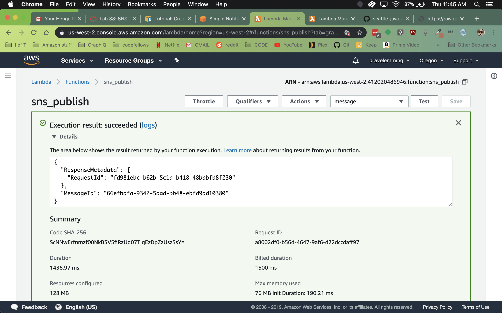
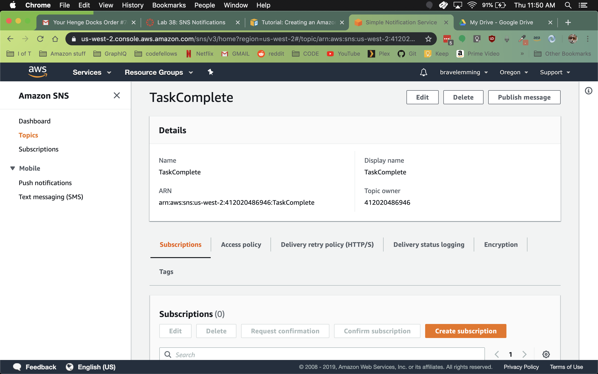

# SNS-notifications lab 38
- For this assignment, you will be creating an SNS Topic, subscribers, and triggers
- author: Jack Daniel Kinne
- Challenge by: Codefellows

## steps 
- Create an SNS Topic
- Name this topic “TaskComplete”
- Note: We will be wiring this into Taskmaster!

- Create a Lambda function that creates a subscriber
- The lambda function should take in a phone number as the event parameter
- This phone number should be registered as an “SMS” subscriber to your topic
- Create a Lambda function that triggers a notification
- This lambda function should publish a message to your topic
- Once published, SNS should then send a text message to the the subscriber you created in the previous step

## subscriber

## publisher

## TaskComplete

## credits and contributions
- Matt Stuhring
- Nhu Trinh
- @Bomibear
- Travis Cox
- Peter Lee
- Padmapriya Ganapathi
- Renee Messick
- Sapana Poudel
- Brandon Hurrington
